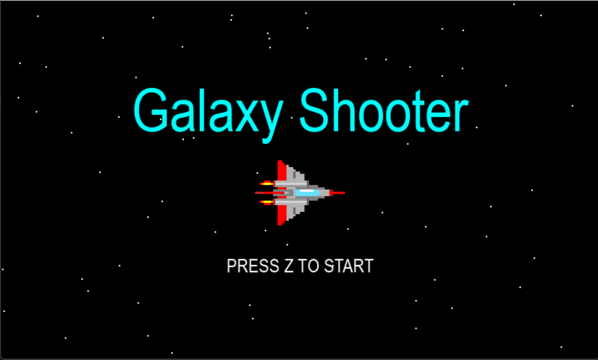

# Galaxy Shooter (Custom Edition)

レトロスタイルの爽快サイドスクロール・シューティングゲームです。
敵を倒してドロップするパーツを回収し、自分好みの機体にカスタマイズして巨大なボスを撃破しましょう。
制作時期：2025年12月～2026年2月

## ゲームの特徴
- **パーツ換装システム**: 最大2つまでの強化パーツを装着可能。
- **3種類の特殊武装**:
    - 🟨 **CANNON (黄色)**: 圧倒的な射程を誇るロングレーザー。
    - 🟦 **VULCAN (水色)**: 広範囲をカバーする3方向拡散弾。
    - 🟥 **DRILL (赤色)**: 高威力の重火器弾。
- **ボスバトル**: 50体の敵を撃破すると現れる巨大ボスとの最終決戦。

## 操作方法
| キー | アクション |
| :--- | :--- |
| **矢印キー** | 自機の移動 |
| **Z キー** | ショット / ゲーム開始 |
| **L-SHIFT** | 一時停止 (PAUSE) |
| **R キー** | リスタート (ゲームオーバー/クリア時) |

1. タイトル画面
　<p align="center">
  
</p>
ゲームを開始すると上図のような画面になりギャラクシーゲームができます。

## インストールと実行方法
1. Python 3.x がインストールされていることを確認してください。
2. `pygame` ライブラリが必要です。未インストールの場合は以下を実行してください：
   ```bash
   pip install pygame
